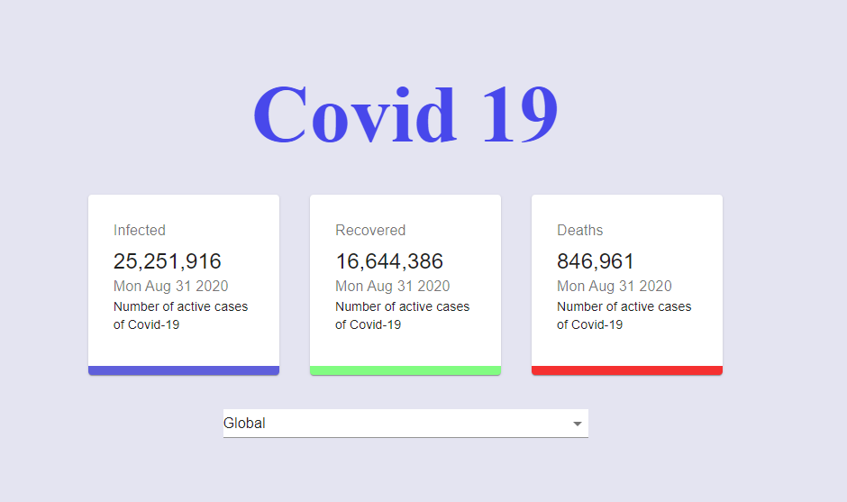

# COVID-19 Tracker

Cette application est créé en utilisant  Material UI, Charts.js, React Hooks, la récupération de données API, le tout dans React JS!

### [Live Site](https://tracker-app-288113.ew.r.appspot.com/)

## Introduction

Cette application est créé en utilisant  Material UI, Charts.js, 

React Hooks, la récupération de données API, le tout dans React JS!

API utlisé :  https://covid19.mathdro.id/api

Pour lancer l'application il suffit juste de lancer npm i ensuite npm start

